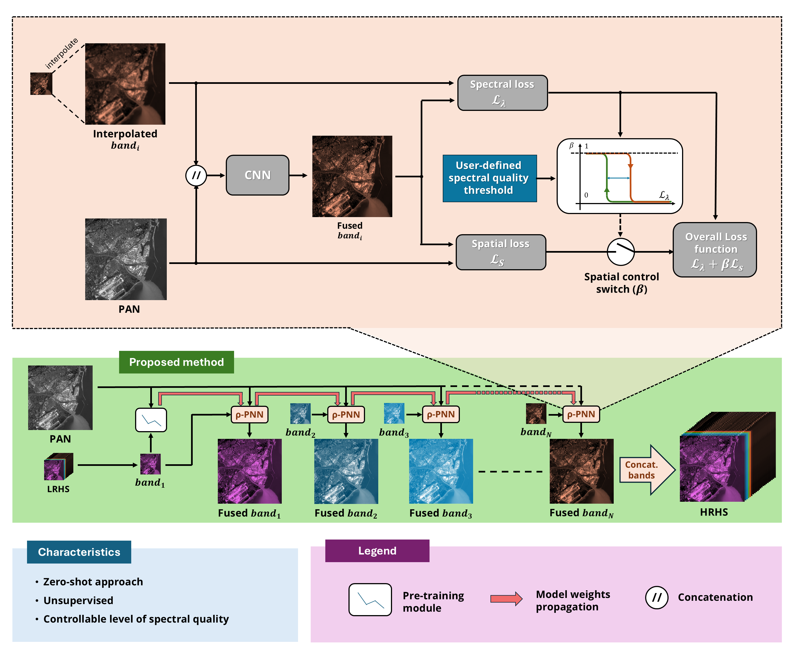

# Zero-Shot Hyperspectral Pansharpening Using Hysteresis-Based Tuning for Spectral Quality Control

[Zero-Shot Hyperspectral Pansharpening Using Hysteresis-Based Tuning for Spectral Quality Control](https://ieeexplore.ieee.org/document/10341305) (  [ArXiv](https://www.google.com/url?q=http://arxiv.org/abs/2311.06510&source=gmail&ust=1700026852089000&usg=AOvVaw0bA5hS9pYGvnMPpmkPF2LT) ) introduces **rho-PNN**, a hyperspectral pansharpening method that ensures uniform spectral quality across all bands. A single lightweight neural network is used, with weights that dynamically adapt to each band during processing. To promote fast spectral convergence, a hysteresis-inspired strategy alternates the activation of the spatial loss during fine-tuning. Additionally, a new spatial loss is introduced to account for nonlinear dependencies between the panchromatic and spectral bands. The resulting method is fully unsupervised, requires no pretraining, and remains flexible and computationally efficient.The proposed method has been evaluated on real hyperspectral images from the PRISMA dataset, at both full and reduced resolutions, and compared against several pansharpening approaches, both model-based and deep learning, using the recently released hyperspectral pansharpening [toolbox](https://github.com/matciotola/hyperspectral_pansharpening_toolbox).

## Scheme overview 


## Cite rho-PNN

If you use rho-PNN in your research, please use the following BibTeX entry.

```
@ARTICLE{10341305,
  author={Guarino, Giuseppe and Ciotola, Matteo and Vivone, Gemine and Scarpa, Giuseppe},
  journal={IEEE Transactions on Geoscience and Remote Sensing}, 
  title={Band-wise Hyperspectral Image Pansharpening using CNN Model Propagation}, 
  year={2023},
  volume={},
  number={},
  pages={1-1},
  doi={10.1109/TGRS.2023.3339337}}
```

## Team members

*   Giuseppe Guarino (giuseppe.guarino2@unina.it);

*   Matteo Ciotola (matteo.ciotola@unina.it);

*   Gemine Vivone;

*   Giovanni Poggi

*   Giuseppe Scarpa  (giuseppe.scarpa@uniparthenope.it).

## License

Copyright (c) 2025 Image Processing Research Group of University Federico II of Naples ('GRIP-UNINA').
All rights reserved.
This software should be used, reproduced and modified only for informational and nonprofit purposes.

By downloading and/or using any of these files, you implicitly agree to all the
terms of the license, as specified in the document [`LICENSE`](https://github.com/giu-guarino/rho-PNN/blob/main/LICENSE.txt)
(included in this package)

## Prerequisites

All the functions and scripts were tested on Windows and Ubuntu O.S., with these constrains:

*   Python 3.10.10
*   PyTorch 2.0.0
*   Cuda 11.7 or 11.8 (For GPU acceleration).

the operation is not guaranteed with other configurations.

## Installation

*   Install [Anaconda](https://www.anaconda.com/products/individual) and [git](https://git-scm.com/downloads)
*   Create a folder in which save the algorithm
*   Download the algorithm and unzip it into the folder or, alternatively, from CLI:

<!---->

    git clone https://github.com/giu-guarino/rho-PNN

*   Create the virtual environment with the `rho_pnn_env.yaml`

<!---->

    conda env create -n rho_pnn_env -f rho_pnn_env.yaml

*   Activate the Conda Environment

<!---->

    conda activate rho_pnn_env

*   Test it

<!---->

    python main.py -i example/PRISMA_example.mat -o ./Output_folder/ 

## Usage

### Before to start


This algorithm has been tested on the dataset provided by the aforementioned toolbox, but it can easily be applied to any `.mat` file organized as follows:

*   `I_MS_LR`: Original Hyperspectral Stack in channel-last configuration (Dimensions: H x W x B);
*   `I_MS`: Upsampled version of original Hyperspectral Stack in channel-last configuration (Dimensions: HR x WR x B);
*   `I_PAN`: Original Panchromatic band, without the third dimension (Dimensions: HR x WR).
*   `wavelengths`: Array of wavelengths (Dimensions: B x 1)

where R is the ratio of the sensor.

### Testing

This project provides a method which works completely from scratch. This means that you don't need any training data, so you can directly start the proposed configuration using the command:

<!---->

    python test.py -i path/to/file.mat

where `path/to/file.mat` can be any dataset (with any number of bands) organized as described before.

You can easily change the spectral quality requirement by modifying the hyperparameters in the `config_dict.py` file.

## Dataset

Instructions for downloading the dataset used in this work can be found at the following [link](https://github.com/matciotola/hyperspectral_pansharpening_toolbox)
